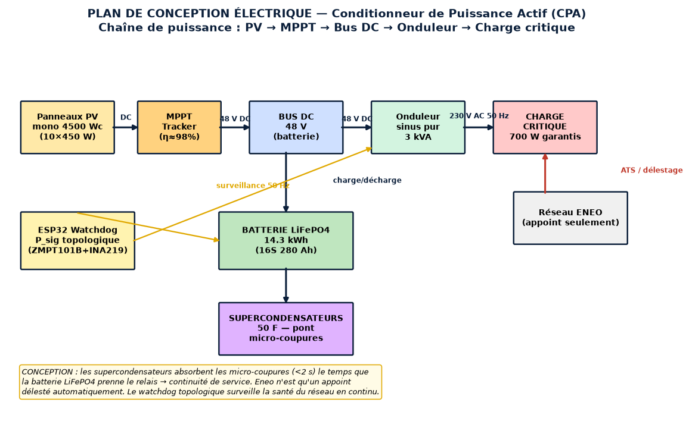
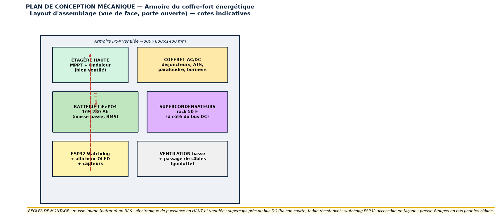
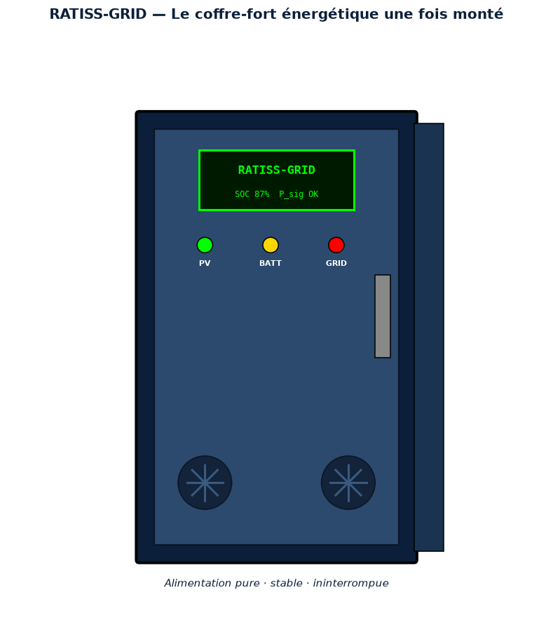
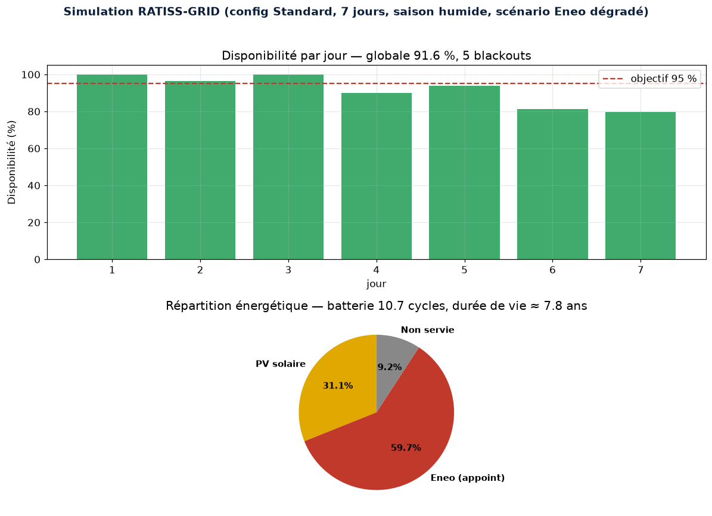
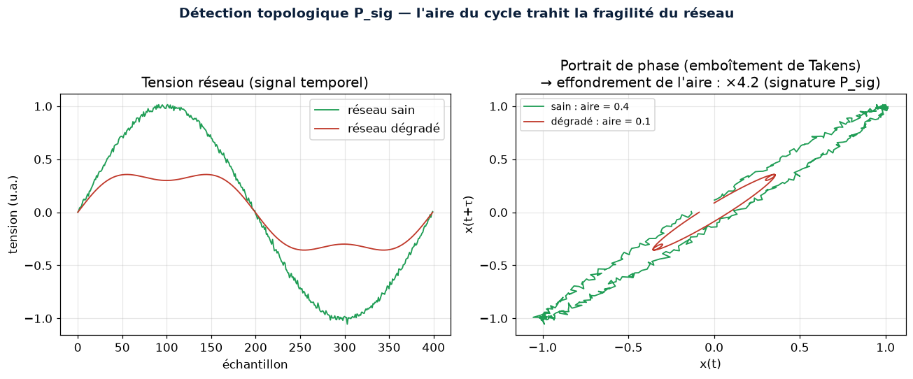

<p align="center">
  
</p>

[](https://github.com/jonathansearch)

<div align="center">


# ⚡ RATISS-GRID

## Coffre-fort énergétique souverain — Priorité 0

**Le nerf de la guerre : une électricité pure, stable et ininterrompue pour le laboratoire souverain camerounais.**

[](https://www.python.org/)
[](LICENSE)
[](CITATION.cff)
[](docs/BOM.md)
[](MEMO_GRID.md)
[](https://orcid.org/0009-0000-4092-5313)

> Propriété intellectuelle : **JOHNKING0 & Jonathan Evina** · RATIS Labs (Cameroun)
> ORCID [0009-0000-4092-5313](https://orcid.org/0009-0000-4092-5313)

**[📘 Document de conception complet → DESIGN.md](DESIGN.md)** ·
**[🔧 Guide de montage → docs/ASSEMBLY.md](docs/ASSEMBLY.md)**

</div>

---

> 🇨🇲 **Un mot au Gouvernement de la République du Cameroun**
>
> La souveraineté d'une nation se mesure à sa capacité à produire, contrôler et
> transmettre sa propre énergie. Tant que nos laboratoires et nos industries
> dépendent d'un réseau fragile et d'équipements importés sans documentation,
> nous restons technologiquement vassaux. RATISS-GRID est la **brique fondatrice**
> d'une infrastructure scientifique nationale — une électricité pure, stable et
> ininterrompue, dimensionnée, documentée et reproductible par nos propres
> ingénieurs, à coût maîtrisé. Ce dépôt est un acte de transfert de savoir-faire.
> Il appartient au Cameroun de s'en saisir. **La souveraineté énergétique n'attend
> pas : elle se construit.**

---

## 🖼️ Le projet en images

> Toutes les figures sont générées par le code (`scripts/generate_figures.py`) —
> les courbes de simulation proviennent du vrai simulateur, pas de données inventées.

### 📐 Plan de conception électrique


### 🔩 Plan de conception mécanique (layout d'assemblage)


### 🏭 L'appareil une fois monté


### 📈 Résultats de simulation (config Standard, réseau dégradé)


### 🧠 Détection topologique P_sig (emboîtement de Takens)


---

## 🎯 Pourquoi la Priorité 0

Un processeur quantique non-cryogénique, un incubateur biochimique à ±0.1 °C ou un
cluster de calcul exigent une **pureté de courant** que le réseau public (Eneo) ne
fournit pas : micro-coupures, creux de tension, bruit harmonique. Le bruit électrique
détruit la cohérence quantique, fausse les mesures biologiques et grille l'électronique
low-cost. **Sans cette brique, tout le reste est inutile.**

RATISS-GRID dimensionne et valide *in silico* un **Conditionneur de Puissance Actif
(CPA)** avant d'acheter le moindre composant :

```
Panneaux PV mono → MPPT → [ LiFePO4 ‖ Supercondensateurs ] → Onduleur sinus pur → Charge critique
                              ▲
                     Détection topologique RATISS
```

Les **supercondensateurs** absorbent les micro-coupures en millisecondes, le temps que
la **batterie LiFePO4** prenne le relais sans interruption. Le réseau Eneo n'est qu'un
appoint — pas une dépendance.

---

## 📐 La loi fondatrice appliquée au réseau

$$R = P_{sig} \qquad\qquad \Delta W = \eta \cdot \varphi \cdot P_{sig} \cdot C$$

Le réseau électrique est modélisé comme un **graphe topologique dynamique** : les nœuds
sont les sources et les charges, les arêtes les lignes. La **signature de persistance
P_sig** (homologie H1, Vietoris-Rips) du nuage de tensions temporelles mesure la
**fragilité structurelle** du réseau — et sert de trigger d'alerte précoce au
basculement supercondensateur → batterie. On certifie la **forme** du réseau, pas
seulement ses ampères.

---

## 🏗️ Architecture du dépôt

```
ratiss-grid/
├── ratiss_grid/
│   ├── eneo_model.py      # Profils de perturbations du réseau Eneo (30 jours)
│   ├── perturbations.py   # Bibliothèque de scénarios de défauts réalistes
│   ├── topology.py        # Réseau comme graphe dynamique + P_sig électrique
│   ├── storage.py         # Dynamique LiFePO4 + supercondensateurs (physique réelle)
│   ├── cpa.py             # Conditionneur de Puissance Actif complet (PV→charge)
│   ├── sizing.py          # Solveur de dimensionnement (config Minimal/Standard/Labo)
│   └── climate.py         # Dégradation climat tropical (chaleur, humidité, poussière)
├── tests/                 # Tests internes (conservation énergie, cas limites)
└── docs/
    ├── BOM.md             # Bill of Materials chiffrée FCFA (sourçable Chine/Dubaï)
    ├── SOURCING.md        # Canaux d'import, délais, pièges douaniers
    ├── ASSEMBLY.md        # Schéma unifilaire + procédure d'assemblage (ENSPY/AIMS)
    └── MAINTENANCE.md     # Maintenance locale, pièces d'usure, diagnostic
```

## 🚀 Quick start

```bash
git clone https://github.com/samajonathan9-source/ratiss-grid.git
cd ratiss-grid
pip install -e .

# Dimensionner un coffre-fort pour une charge critique de 2 kW sur 30 jours
python -m ratiss_grid.size_my_grid --load 2000 --days 30

# Monte Carlo : 1000 scénarios climatiques → taux de disponibilité
python -m ratiss_grid.size_my_grid --load 2000 --days 30 --monte-carlo 1000
```

Dépendances minimales : `numpy`. Tests : `pytest tests/ -q`.

---

## 🔬 Configurations de référence

| Config | Charge critique | Usage | Budget estimé |
|---|:---:|---|---:|
| **Minimal** | 500 W | Banc QPU photonique + PC de contrôle | 2–3 M FCFA |
| **Standard** ⭐ | 2 kW | QPU + incubateur bio + poste de travail | 5–8 M FCFA |
| **Labo complet** | 5 kW | Écosystème RATISS entier (QPU + wetlab + HPC) | 10–15 M FCFA |

La configuration de référence du dépôt est **Standard 2 kW**. Le solveur reste
paramétrable pour les trois.

## ⚠️ Transparence ingénierie

Ce dépôt produit des **prédictions de simulation rigoureuses**, pas des mesures
terrain. La validation finale exige le prototype physique assemblé par les ingénieurs
locaux (ENSPY, AIMS Limbé, diaspora) et instrumenté. **Jamais figé, toujours itérer.
Ne jamais prétendre un résultat non mesuré — documenter les échecs.**

---

## 📄 Licence & citation

- **Licence** : [MIT](LICENSE) — © JOHNKING0 & Jonathan Evina, RATIS Labs (Cameroun).
- **Citation** : voir [CITATION.cff](CITATION.cff). GitHub l'affiche dans l'onglet
  « Cite this repository ». Merci de citer l'ORCID
  [0009-0000-4092-5313](https://orcid.org/0009-0000-4092-5313) dans vos travaux.

---

*Doctrine matérielle souveraine du Cameroun — Priorité 0 sur 4.
Suivantes : QPU non-cryogénique → Labo bio low-cost → Cluster HPC local → Atelier de fabrication.*
