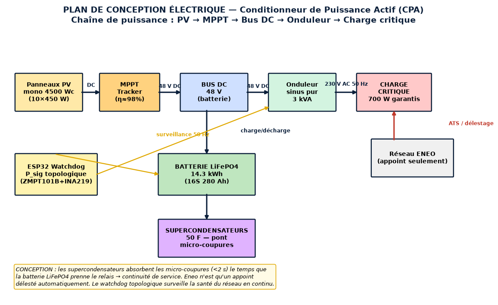
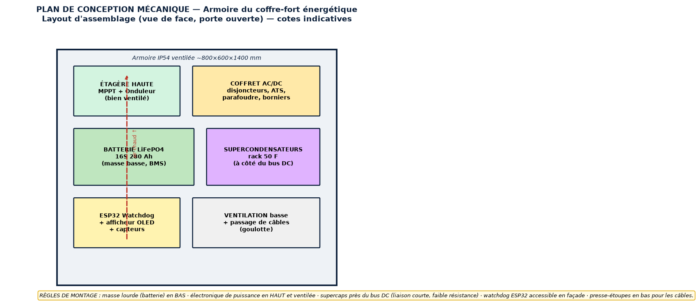
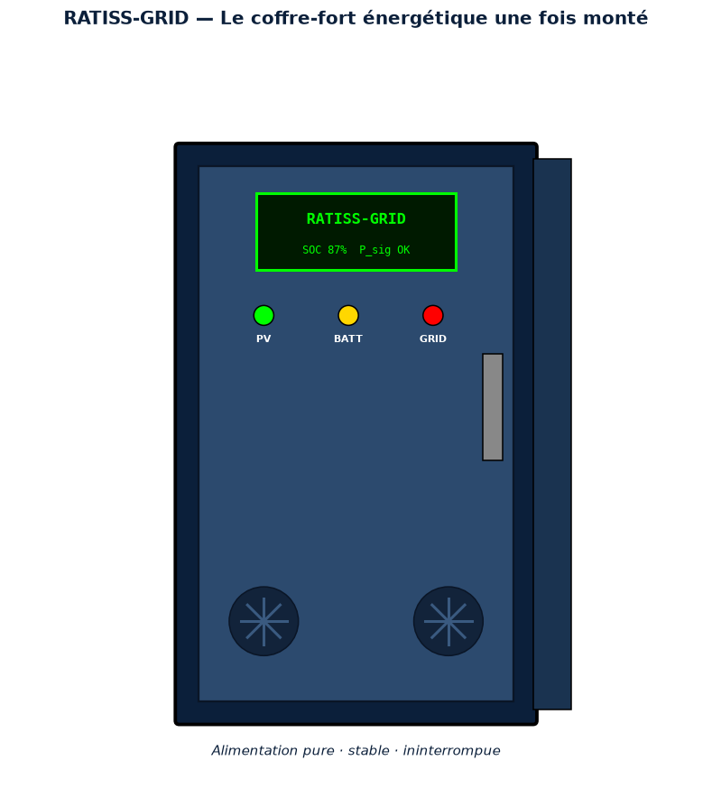
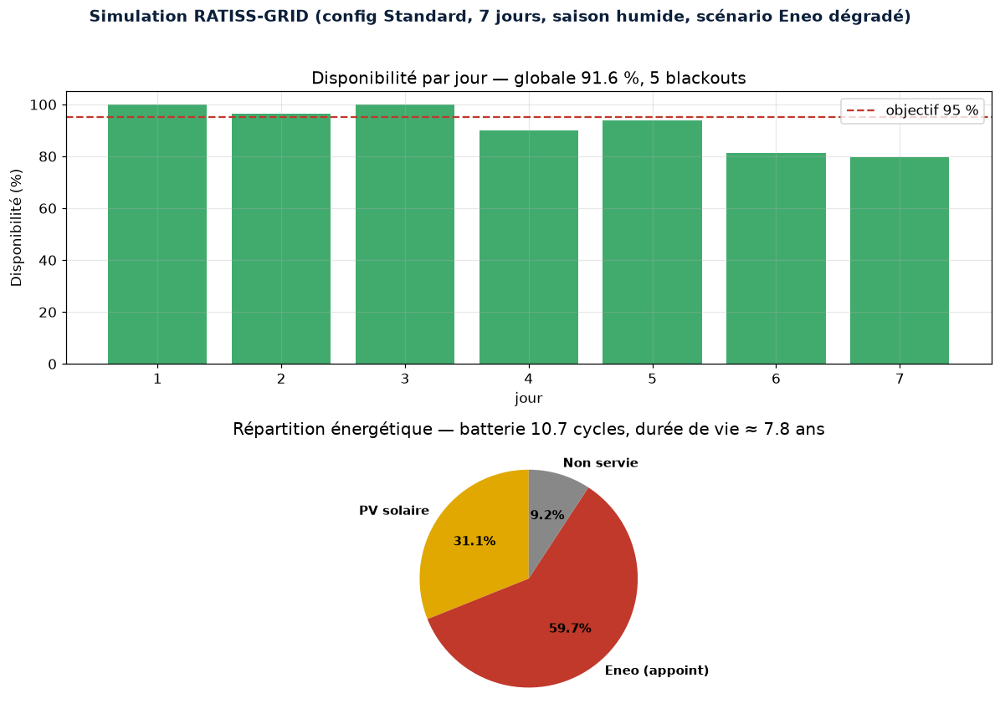
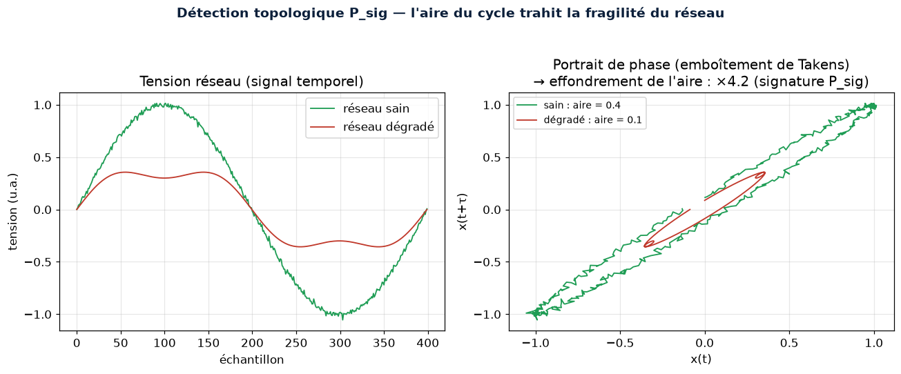

<p align="center">
  
</p>

[](https://github.com/jonathansearch)

<div align="center">


# ⚡ RATISS-GRID

## Sovereign Energy Vault — Priority 0

**The lifeline of the whole effort: pure, stable and uninterrupted electricity for the sovereign Cameroonian laboratory.**

[](https://www.python.org/)
[](LICENSE)
[](CITATION.cff)
[](docs/BOM.md)
[](MEMO_GRID.md)
[](https://orcid.org/0009-0000-4092-5313)

> Intellectual property: **JOHNKING0 & Jonathan Evina** · RATIS Labs (Cameroon)
> ORCID [0009-0000-4092-5313](https://orcid.org/0009-0000-4092-5313)

**[📘 Full design document → DESIGN.md](DESIGN.md)** ·
**[🔧 Assembly guide → docs/ASSEMBLY.md](docs/ASSEMBLY.md)**

</div>

---

> 🇨🇲 **A word to the Government of the Republic of Cameroon**
>
> A nation's sovereignty is measured by its capacity to produce, control and
> transmit its own energy. As long as our laboratories and our industries
> depend on a fragile grid and on imported equipment with no documentation,
> we remain technological vassals. RATISS-GRID is the **foundational building
> block** of a national scientific infrastructure — pure, stable and
> uninterrupted electricity, sized, documented and reproducible by our own
> engineers, at a controlled cost. This repository is an act of know-how
> transfer. It is up to Cameroon to seize it. **Energy sovereignty does not
> wait: it is built.**

---

## 🖼️ The project in images

> All figures are generated by code (`scripts/generate_figures.py`) —
> the simulation curves come from the real simulator, not from invented data.

### 📐 Electrical design blueprint


### 🔩 Mechanical design blueprint (assembly layout)


### 🏭 The device once assembled


### 📈 Simulation results (Standard config, degraded grid)


### 🧠 P_sig topological detection (Takens embedding)


---

## 🎯 Why Priority 0

A non-cryogenic quantum processor, a biochemical incubator at ±0.1 °C or a
compute cluster require a **power purity** that the public grid (Eneo) does not
provide: micro-outages, voltage sags, harmonic noise. Electrical noise
destroys quantum coherence, skews biological measurements and fries low-cost
electronics. **Without this building block, everything else is useless.**

RATISS-GRID sizes and validates *in silico* an **Active Power Conditioner
(APC)** before buying a single component:

```
Mono PV panels → MPPT → [ LiFePO4 ‖ Supercapacitors ] → Pure sine inverter → Critical load
                              ▲
                     RATISS topological detection
```

The **supercapacitors** absorb micro-outages in milliseconds, the time for the
**LiFePO4 battery** to take over without interruption. The Eneo grid is only a
top-up — not a dependency.

---

## 📐 The founding law applied to the grid

$$R = P_{sig} \qquad\qquad \Delta W = \eta \cdot \varphi \cdot P_{sig} \cdot C$$

The electrical grid is modeled as a **dynamic topological graph**: nodes
are sources and loads, edges are lines. The **P_sig persistence signature**
(H1 homology, Vietoris-Rips) of the cloud of time-series voltages measures the
**structural fragility** of the grid — and serves as an early-warning trigger
for the supercapacitor → battery switchover. We certify the **form** of the
grid, not just its amperes.

---

## 🏗️ Repository architecture

```
ratiss-grid/
├── ratiss_grid/
│   ├── eneo_model.py      # Eneo grid disturbance profiles (30 days)
│   ├── perturbations.py   # Library of realistic fault scenarios
│   ├── topology.py        # Grid as dynamic graph + electrical P_sig
│   ├── storage.py         # LiFePO4 + supercapacitor dynamics (real physics)
│   ├── cpa.py             # Full Active Power Conditioner (PV→load)
│   ├── sizing.py          # Sizing solver (Minimal/Standard/Lab config)
│   └── climate.py         # Tropical climate degradation (heat, humidity, dust)
├── tests/                 # Internal tests (energy conservation, edge cases)
└── docs/
    ├── BOM.md             # Bill of Materials priced in FCFA (sourceable China/Dubai)
    ├── SOURCING.md        # Import channels, lead times, customs pitfalls
    ├── ASSEMBLY.md        # Single-line diagram + assembly procedure (ENSPY/AIMS)
    └── MAINTENANCE.md     # Local maintenance, wear parts, diagnostics
```

## 🚀 Quick start

```bash
git clone https://github.com/samajonathan9-source/ratiss-grid.git
cd ratiss-grid
pip install -e .

# Size a vault for a 2 kW critical load over 30 days
python -m ratiss_grid.size_my_grid --load 2000 --days 30

# Monte Carlo: 1000 climate scenarios → availability rate
python -m ratiss_grid.size_my_grid --load 2000 --days 30 --monte-carlo 1000
```

Minimal dependency: `numpy`. Tests: `pytest tests/ -q`.

---

## 🔬 Reference configurations

| Config | Critical load | Usage | Estimated budget |
|---|:---:|---|---:|
| **Minimal** | 500 W | Photonic QPU bench + control PC | 2–3 M FCFA |
| **Standard** ⭐ | 2 kW | QPU + bio incubator + workstation | 5–8 M FCFA |
| **Full lab** | 5 kW | Entire RATISS ecosystem (QPU + wetlab + HPC) | 10–15 M FCFA |

The reference configuration of the repository is **Standard 2 kW**. The solver
remains configurable for all three.

## ⚠️ Engineering transparency

This repository produces **rigorous simulation predictions**, not field
measurements. Final validation requires the physical prototype assembled by the
local engineers (ENSPY, AIMS Limbé, diaspora) and instrumented. **Never frozen,
always iterating. Never claim an unmeasured result — document the failures.**

---

## 📄 License & citation

- **License**: [MIT](LICENSE) — © JOHNKING0 & Jonathan Evina, RATIS Labs (Cameroon).
- **Citation**: see [CITATION.cff](CITATION.cff). GitHub displays it in the
  "Cite this repository" tab. Please cite the ORCID
  [0009-0000-4092-5313](https://orcid.org/0009-0000-4092-5313) in your work.

---

*Cameroon sovereign hardware doctrine — Priority 0 of 4.
Next: non-cryogenic QPU → low-cost bio lab → local HPC cluster → manufacturing workshop.*
